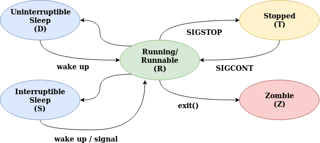

# Exercise 03: Processes

## Basics
a. Execute `ps aux` (help under `man ps`). What information/filter options is available for processes?

b. The `/proc/self/` directory contains information about the current process via the virtual file system. Execute the following two commands once directly in the shell and once as a saved script and view the result:
```bash
#!/bin/sh
cd /proc/self/fd
ls -l
```

c. Most shell commands (such as ls, ps, rm, cp, etc.) are implemented by creating separate processes to run them. However, this is not the case with the cd (change directory) command. Explain why not.

### Process States


The different process states in Linux[1]

A process can be in one of multiple states. The letter in parentheses is the shortcut used in the STAT column of `ps aux`. 
* Running / Runnable (R): The process is either currently executed on a processor or waiting to be executed.
* Uninterruptible Sleep (D): The process is blocking on some IO operations, which isn't interruptable by the Kernel. Use `ps aux` and scan through all currently "running" processes. Why are there so many in the D state and not many in the R state?
* Interruptible Sleep (S): The process is blocking on some IO operation, that is interruptable by signals. 
* Stopped (T): The process was stopped in the terminal. Try this by running a long-running process like `sleep 100` in the terminal and hitting `ctrl-z`. Verify the state change with `ps aux`. You can exit the stopped state by typing `fg %1`
* Zombie (Z): The process was terminated. However, the termination wasn't yet acknowledged by the parent process.

## Signals
If a process wants the Linux Kernel to perform an operation, syscalls are used. In the opposite direction there are so-called signals, which are sent when another process or the kernel wants to notify a process about an event that has just occurred. This could be for example a timer, a notification about the state change of the current process to or from stopped, or a termination request. (More infomation in `man 7 signal`)

### Terminating a process using `kill`
1. Start a long-running process. e.g. `sleep 1000`
2. Find the corresponding process id (pid) in `ps aux`
3. Execute `kill <pid of the long-running process>`

This procedure can be used to terminate a process that is currently not attached to the terminal. If a process isn't responding use `kill -9 <pid>` to send a SIGKILL. The name 'kill' is also somewhat deceptive, so you can use `kill -19` to send SIGSTOP which stops the process or `kill -14` to trigger the alarm clock.

## Fork
### Code analysis
Read the description of the `fork` syscall (`man 2 fork`). What is the behavior? What values are returned?

Inspect the following three code snippets and answer the respective questions.
```c
#include <sys/types.h>
#include <stdio.h>
#include <unistd.h>

static int value = 5;

int main (int argc, char** argv) {
    pid_t pid = fork();
    if(pid == 0) { // child process
        value += 15;
    } else if(pid > 0) { // parent process
        wait(NULL); // Wait for child process to finish
        printf("PARENT: value = %d", value);
    }
}
```
What is printed out by the `printf` statement?


```c
#include <stdio.h>
#include <unistd.h>

int main (int argc, char** argv) {
    // fork a child process
    fork();

    // fork another child process
    fork();
    
    // and another child process
    fork();
}
```
How many processes of the given program will be instantiated, when executed once? 

```c
#include <stdio.h>
#include <unistd.h>

int main (int argc, char** argv) {
    int i,
    for(i = 0, i < 4; i++)
        fork();
    return 0;
}
```
Again, how many processes of the given program will be instantiated, when executed once? 


### Custom Pipe Implementation
Using a shell like bash or zsh you can "pipe" the output from one program to the input of another program, while both running concurently. e.g.:
```bash
# Display kernel logs in a browsable manner
dmesg | less
# Show a hexdump of the Master Boot Record
sudo head -c 512 /dev/sda | xxd
# Print the forecasted average temperature in Stuttgart for the next three days
curl wttr.in/Stuttgart?format=j1 2>/dev/null | jq '.weather[] | {date: .date, avgTemp: .avgtempC}'
```
Now our goal is, to implement this pipe meachnism by ourselvs. This mean write a programm that 1. acceptes the names of the both programs to be run with its parameters. The syntax should be the same as in the bash: e.g. `./pipe ls -al "|" xxd -u`. Please note note that you have to escape the `|` in the Shell to be not interpreted. 2. runs both programs as subprocess and 3. "pipe" the STDOUT of the first program to the STDIN of the second program.

Also keep an eye on correct termination of the pipes and subprocesses, we don't want any zombies.
Use `pipe.c` as basis. You will need to use the following functions: `fork`, `execvp` and `wait` for creating the subprocesses and `pipe`, `dup2` and `close` for implementing the piping between the both programs. All functions have of cause manpages.


## Using Processes out of Java
sed is a so-called stream editor. You pass sed e.g. a search-replace pattern as parameter.
This pattern is then applyed on the data send to STDIN before written back out to STDOUT. The following examples shows how you can use this for capitalizing a string:

```bash
echo operating systems hft stuttgart | sed 's/[^ _-]*/\u&/g'
# => Operating Systems Hft Stuttgart
```

Now inspect the file `Sed.java` an implement a wrapper of sed in the method `sed`, that passes the pattern as parameter, writes the input text to STDIN and read the output from STDOUT.
The required classes are already imported. The detailed Javadoc of `ProcessBuilder` can be found [here](https://docs.oracle.com/javase/8/docs/api/java/lang/ProcessBuilder.html).

Hints:
* `getInputStream` and `getOutputStream` refer to to STDOUT ans STDIN of the subprocess respectivly. 
* you will need to close the outputstream after writing the input text,


[1]: https://cloudchef.medium.com/linux-process-states-and-signals-a967d18fab64
